# PSoC&trade; 4: Device Firmware Upgrade (DFU) host

This example demonstrates how to create an I2C-based DFU Host on [PSoC&trade; 4100S Max Pioneer Kit](https://www.infineon.com/CY8CKIT-041S-MAX/) (`CY8CKIT-041S-MAX`) and flash the PSoC&trade; 4000T target device. 

This code example supports three actions; erase, program, and verify. Also, this project helps to understand how the DFU host works, communicates with the bootloader to update the firmware, and creates a DFU host on a PSoC&trade; 4100S Max Pioneer Kit using the ModusToolbox&trade;.

[View this README on GitHub.](https://github.com/Infineon/mtb-example-psoc4-dfu-host)

[Provide feedback on this code example.](https://cypress.co1.qualtrics.com/jfe/form/SV_1NTns53sK2yiljn?Q_EED=eyJVbmlxdWUgRG9jIElkIjoiQ0UyMzgxNTYiLCJTcGVjIE51bWJlciI6IjAwMi0zODE1NiIsIkRvYyBUaXRsZSI6IlBTb0MmdHJhZGU7IDQ6IERldmljZSBGaXJtd2FyZSBVcGdyYWRlIChERlUpIGhvc3QiLCJyaWQiOiJkYXNhdmlqaXQiLCJEb2MgdmVyc2lvbiI6IjIuMC4wIiwiRG9jIExhbmd1YWdlIjoiRW5nbGlzaCIsIkRvYyBEaXZpc2lvbiI6Ik1DRCIsIkRvYyBCVSI6IklDVyIsIkRvYyBGYW1pbHkiOiJQU09DIn0=)

## Requirements

- [ModusToolbox&trade;](https://www.infineon.com/cms/en/design-support/tools/sdk/modustoolbox-software) v3.1 or later

> **Note:** This code example version requires ModusToolbox&trade; version 3.1 or later and is not backward compatible with v3.0 or older versions.
- Board support package (BSP) minimum required version: 3.1.0
- Programming language: C
- Associated parts: All [PSoC&trade; 4 MCU](https://www.infineon.com/cms/en/product/microcontroller/32-bit-psoc-arm-cortex-microcontroller/psoc-4-32-bit-arm-cortex-m0-mcu/) parts

## Supported toolchains (make variable 'TOOLCHAIN')

- GNU Arm&reg; Embedded Compiler v11.3.1 (`GCC_ARM`) – Default value of `TOOLCHAIN`
- Arm&reg; Compiler v6.16 (`ARM`)
- IAR C/C++ Compiler v9.30.1 (`IAR`)


## Supported kits (make variable 'TARGET')

- [PSoC&trade; 4100S Max Pioneer Kit](https://www.infineon.com/CY8CKIT-041S-MAX/) (`CY8CKIT-041S-MAX`) - Default value of `TARGET`

## Hardware setup

If the target PSoC&trade; 4000T is running at 3.3 V, change the jumper J10 pointed out in **Figure 1** of the CY8CKIT-041S-MAX to 3.3 V. If the target device is running at 1.8 V, a logic-level translator in the I2C bus is required. 

> **Note:** Ensure the target board is also powered appropriately.

**Figure 1. Jumper J10 to 3.3 V connection** 


Connect the I2C pins, P\[1\]0 and P\[1\]1 (SCL and SDA), of CY8CKIT-041S-MAX to the I2C pins of the target board, Ensure both boards have a common ground.
**Figure 2** shows the Host and Target connected via I2C.

**Figure 2. Device connection using I2C**  
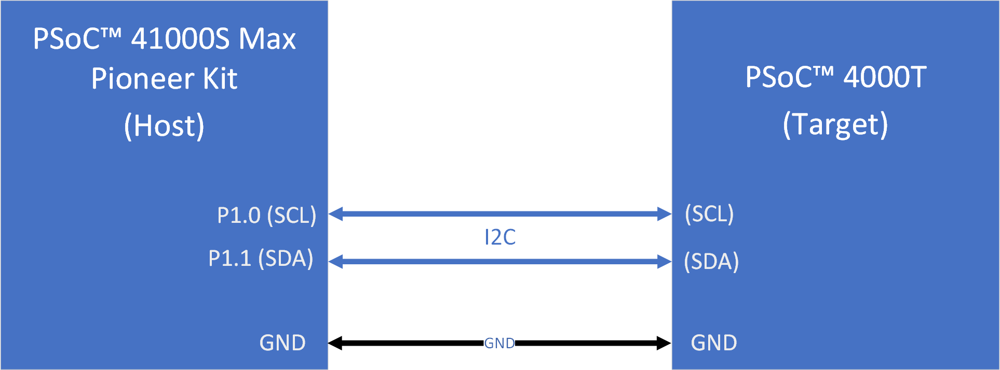

> **Note:** The earlier mentioned kit ship with the older version of KitProg firmware installed. You can upgrade to the latest version of the KitProg firmware. The tool and instructions are available in the [Firmware loader](https://github.com/Infineon/Firmware-loader) GitHub repository. If you do not upgrade, you will get a warning that "KitProg firmware is out of date, please update to the latest version".
<br>

## Using the code example

### Create the project

The ModusToolbox&trade; tools package provides the Project Creator as both a GUI tool and a command line tool.

<details><summary><b>Use Project Creator GUI</b></summary>

1. Open the Project Creator GUI tool.

   There are several ways to do this, including launching it from the dashboard or from inside the Eclipse IDE. For more details, see the [Project Creator user guide](https://www.infineon.com/ModusToolboxProjectCreator) (locally available at *{ModusToolbox&trade; install directory}/tools_{version}/project-creator/docs/project-creator.pdf*).

2. On the **Choose Board Support Package (BSP)** page, select a kit supported by this code example. See [Supported kits](#supported-kits-make-variable-target).

   > **Note:** To use this code example for a kit not listed here, you may need to update the source files. If the kit does not have the required resources, the application may not work.

3. On the **Select Application** page:

   a. Select the **Applications(s) Root Path** and the **Target IDE**.

   > **Note:** Depending on how you open the Project Creator tool, these fields may be pre-selected for you.

   b.	Select this code example from the list by enabling its check box.

   > **Note:** You can narrow the list of displayed examples by typing in the filter box.

   c. (Optional) Change the suggested **New Application Name** and **New BSP Name**.

   d. Click **Create** to complete the application creation process.

</details>

<details><summary><b>Use Project Creator CLI</b></summary>

The 'project-creator-cli' tool can be used to create applications from a CLI terminal or from within batch files or shell scripts. This tool is available in the *{ModusToolbox&trade; install directory}/tools_{version}/project-creator/* directory.

Use a CLI terminal to invoke the 'project-creator-cli' tool. On Windows, use the command-line 'modus-shell' program provided in the ModusToolbox&trade; installation instead of a standard Windows command-line application. This shell provides access to all ModusToolbox&trade; tools. You can access it by typing "modus-shell" in the search box in the Windows menu. In Linux and macOS, you can use any terminal application.

The following example clones the "[PSoC&trade; 4: Device Firmware Upgrade (DFU) host](https://github.com/Infineon/mtb-example-psoc4-dfu-host)" application with the desired name "MyDFUHost" configured for the *CY8CKIT-041S-MAX* BSP into the specified working directory, *C:/mtb_projects*:

   ```
   project-creator-cli --board-id CY8CKIT-041S-MAX --app-id mtb-example-psoc4-dfu-host --user-app-name MyHelloWorld --target-dir "C:/mtb_projects"
   ```

<mark>Update the above paragraph and commands to match your CE.

The 'project-creator-cli' tool has the following arguments:

Argument | Description | Required/optional
---------|-------------|-----------
`--board-id` | Defined in the <id> field of the [BSP](https://github.com/Infineon?q=bsp-manifest&type=&language=&sort=) manifest | Required
`--app-id`   | Defined in the <id> field of the [CE](https://github.com/Infineon?q=ce-manifest&type=&language=&sort=) manifest | Required
`--target-dir`| Specify the directory in which the application is to be created if you prefer not to use the default current working directory | Optional
`--user-app-name`| Specify the name of the application if you prefer to have a name other than the example's default name | Optional

> **Note:** The project-creator-cli tool uses the `git clone` and `make getlibs` commands to fetch the repository and import the required libraries. For details, see the "Project creator tools" section of the [ModusToolbox&trade; tools package user guide](https://www.infineon.com/ModusToolboxUserGuide) (locally available at {ModusToolbox&trade; install directory}/docs_{version}/mtb_user_guide.pdf).

</details>

### Open the project

After the project has been created, you can open it in your preferred development environment.


<details><summary><b>Eclipse IDE</b></summary>

If you opened the Project Creator tool from the included Eclipse IDE, the project will open in Eclipse automatically.

For more details, see the [Eclipse IDE for ModusToolbox&trade; user guide](https://www.infineon.com/MTBEclipseIDEUserGuide) (locally available at *{ModusToolbox&trade; install directory}/docs_{version}/mt_ide_user_guide.pdf*).

</details>


<details><summary><b>Visual Studio (VS) Code</b></summary>

Launch VS Code manually, and then open the generated *{project-name}.code-workspace* file located in the project directory.

For more details, see the [Visual Studio Code for ModusToolbox&trade; user guide](https://www.infineon.com/MTBVSCodeUserGuide) (locally available at *{ModusToolbox&trade; install directory}/docs_{version}/mt_vscode_user_guide.pdf*).

</details>


<details><summary><b>Keil µVision</b></summary>

Double-click the generated *{project-name}.cprj* file to launch the Keil µVision IDE.

For more details, see the [Keil µVision for ModusToolbox&trade; user guide](https://www.infineon.com/MTBuVisionUserGuide) (locally available at *{ModusToolbox&trade; install directory}/docs_{version}/mt_uvision_user_guide.pdf*).

</details>


<details><summary><b>IAR Embedded Workbench</b></summary>

Open IAR Embedded Workbench manually, and create a new project. Then select the generated *{project-name}.ipcf* file located in the project directory.

For more details, see the [IAR Embedded Workbench for ModusToolbox&trade; user guide](https://www.infineon.com/MTBIARUserGuide) (locally available at *{ModusToolbox&trade; install directory}/docs_{version}/mt_iar_user_guide.pdf*).

</details>


<details><summary><b>Command line</b></summary>

If you prefer to use the CLI, open the appropriate terminal, and navigate to the project directory. On Windows, use the command-line 'modus-shell' program; on Linux and macOS, you can use any terminal application. From there, you can run various `make` commands.

For more details, see the [ModusToolbox&trade; tools package user guide](https://www.infineon.com/ModusToolboxUserGuide) (locally available at *{ModusToolbox&trade; install directory}/docs_{version}/mtb_user_guide.pdf*).

</details>
 


## Operation

1. Connect the board to your PC using the provided USB cable.

2. Select the 'mtb-example-psoc4-dfu-host' and click 'Build Application' as shown in **Figure 5** to build the project.

   **Figure 5. Building the application**  
   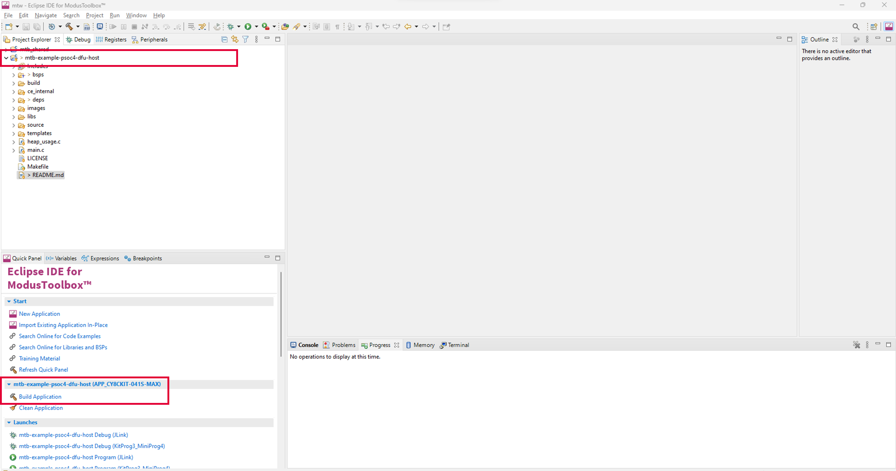

3. Flashing the project
   <details><summary><b>Using Eclipse IDE for ModusToolbox&trade;</b></summary>

      1. Select the 'mtb-example-psoc4-dfu-host' project in the Project Explorer.

      2. In the **Quick Panel**, scroll down, and click **mtb-example-psoc4-dfu-host Program (KitProg3_MiniProg4)**.

      **Figure 6. Flashing project**  
      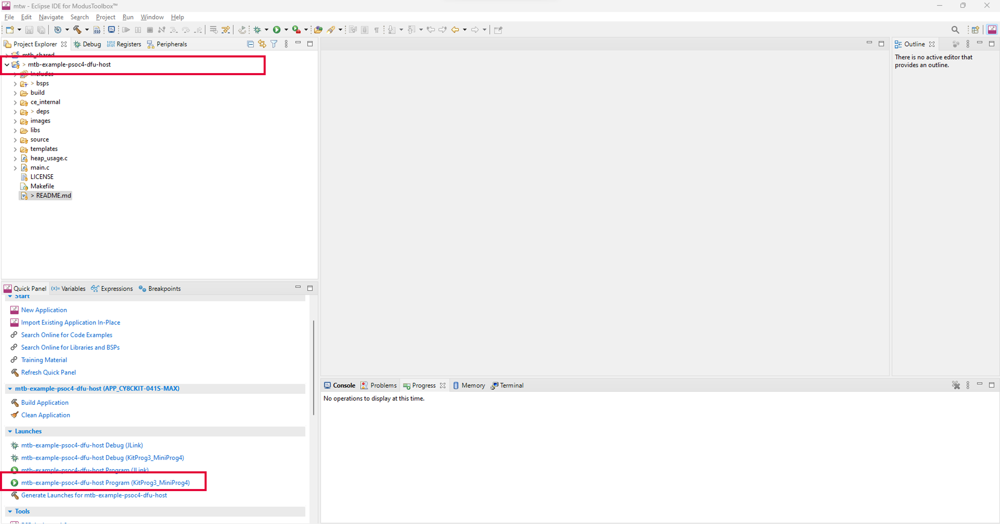

   </details>

   <details><summary><b>Using CLI</b></summary>

     From the terminal, execute the `make program` command to build and program the application using the default toolchain to the default target with default DFU transport. You can specify a target, toolchain, and transport manually:
      ```
      make program TOOLCHAIN=<toolchain>
      ```

      Example:
      ```
      make program TOOLCHAIN=GCC_ARM
      ```
      > **Note:** Modify the TOOLCHAIN variable from the makefile according to your requirement. However, you need to provide the compiler path in the variable named `CY_COMPILER_PATH=` in the makefile.
   </details>


<br>

The DFU host can perform a firmware update on the target only if the DFU target has a compatible bootloader and is in Bootloader mode. If the PSoC&trade; 4000T DFU target device has previously been updated, it will boot to the application every time it is powered up. The device must be switched to bootloader mode by any existing mechanism in the application or by erasing the whole device and re-programming the Bootloader.

Using the user button on the kit, you can either program and verify the firmware application into the target or erase the firmware application from the target.
   
   - Press the user button (single-click) to program and verify the firmware application into the target device.
   - Press and hold the user button for a second to erase the firmware application into the target device.

After programming the firmware image to the target device (PSoC&trade; 4000T), the pin P0.4 of the target device (PSoC&trade; 4000T) toggles at an interval of 500 ms.

The programming status from the DFU host board (i.e., PSoC&trade; 4100S Max Pioneer Kit)  can display the programming status on a serial terminal (i.e., PuTTy), see **Figure 7**.

**Figure 7. Serial output**  

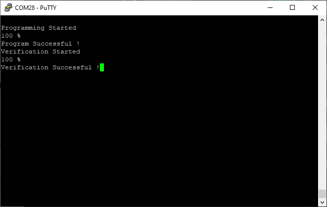

You can select the verbose option to print the commands and data that are sent to the target device (PSoC&trade; 4000T) by the PSoC&trade; 4100S Max host. To enable it, set the macro `VERBOSE_PRINT` to **1** in the *cybtldr_api.c* file. 
The UART terminal displays the commands and the data that are sent over I2C, see **Figure 8**.

**Figure 8. Verbose output**  

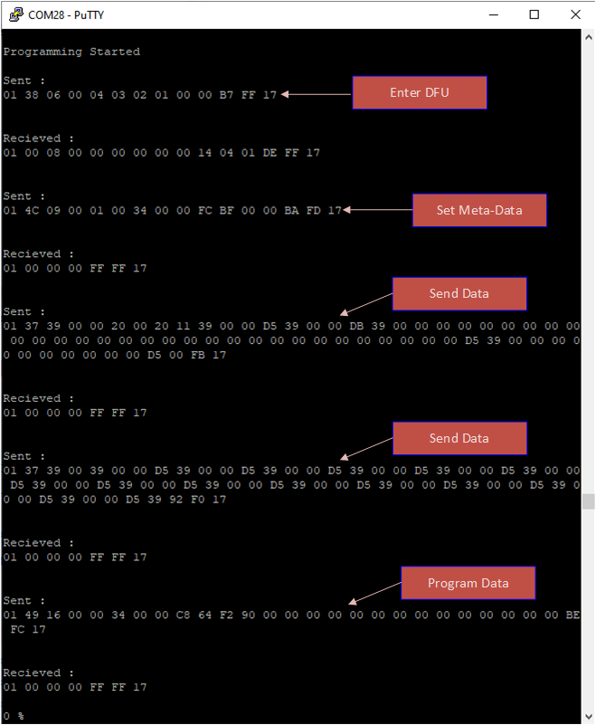

By default, the application image present in stringImage.h of this Code Example blinks an LED. The target PSoC&trade; 4000T device Product ID is 0x3614. The application also implements an I2C slave peripheral at address `0x10`. When a particular command is received at this I2C address, the device switches to bootloader mode. This command can be sent to I2C terminal software using an USB bridge or an MCU. The command consists of 3 bytes: `0x01, 0xEA, and 0x17`.


## Debugging

You can debug the example to step through the code. 

<details><summary><b>In Eclipse IDE</b></summary>

Use the **\<Application Name> Debug (KitProg3_MiniProg4)** configuration in the **Quick Panel**. For details, see the "Program and debug" section in the [Eclipse IDE for ModusToolbox&trade; user guide](https://www.infineon.com/MTBEclipseIDEUserGuide).

</details>


<details><summary><b>In other IDEs</b></summary>

Follow the instructions in your preferred IDE.

</details>


## Design and implementation

### Overview

This example demonstrates the basic DFU operations based on the [DFU middleware library](https://github.com/Infineon/dfu).

### DFU host flow

   This section explains how the DFU command response protocol works and how it is used to implement a DFU host on a PSoC&trade; 4100S Max Pioneer Kit.
   
   The DFU process takes place through a series of commands and responses provided by the DFU middleware. **Figure 9** shows the default flow of commands and responses between the host and target during the update process. 
   
   A DFU session always starts with an Enter DFU command from the host to the target. After the target acknowledges the command from the host, the DFU session is established. Commands and responses are exchanged between the host and the target to perform a specified function, such as data transfer and update. A session can be terminated with an Exit DFU command or by a timeout of 10 ms (milliseconds). This timeout resets after each command sent by the host at the host side. 
   
   As shown in **Figure 9**, the host sends the data to the target by using a series of send data commands with data for a single row. A program data command for each row follows this, instructing the device to write a particular row of data into the device memory. Similarly, it can verify and erase the image by sending appropriate commands. 

   **Figure 9. DFU flow**
     
   

   For more details on the command and response, see Section B of the [AN236282](https://www.infineon.com/AN236282).

   
   ### Application firmware image
   
   To program the target device PSoC&trade; 4000T, the firmware image must be stored in the host MCU. To do so, convert the bootloadable *.cyacd2* file to a string array, where each line (row) will be represented as a string element of the array. Refer to Section 12.1 of [AN236282](https://www.infineon.com/AN236282) for more about the file strucure of cyacd2 file.

   An example of this string array is provided in this code example, which is stored in the *string_Image.h* file located in the source folder *mtb-example-psoc4-dfu-host/source*.
   
   > **Note:** Each line inside the *.cyacd2* file is considered one row of data.

   **Figure 10. *string_Image.h* file location**  

   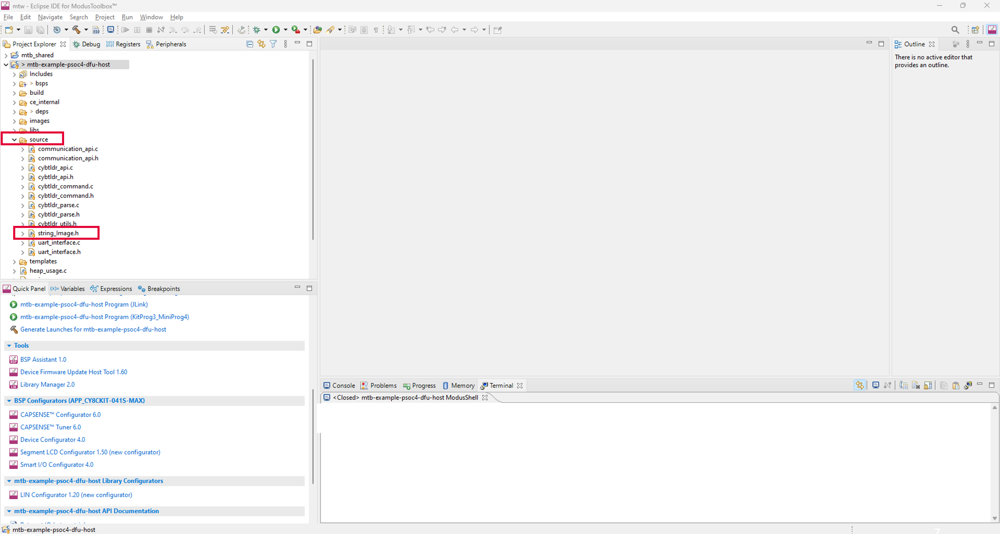

   You can generate this *string_image.h* file from the *.cyacd2* file by copying each line, placing it as a string to form the array, and including it in the *main.c* file. This file is unique for each application, so every time you have to generate or make it separately.


   ### *string_Image.h* file structure

   The structure of your *string_Image.h* file is predefined and needs to be consistent. It must contain a line count as a macro. This helps to identify the total number of lines (elements) present in the array. It must store all the data in the form of a string array, where each line of the *.cyacd2* file represents one element of an array. **Figure 11** shows the structure of the *string_Image.h* file.

   **Figure 11. *string_Image.h* file structure**  
   
   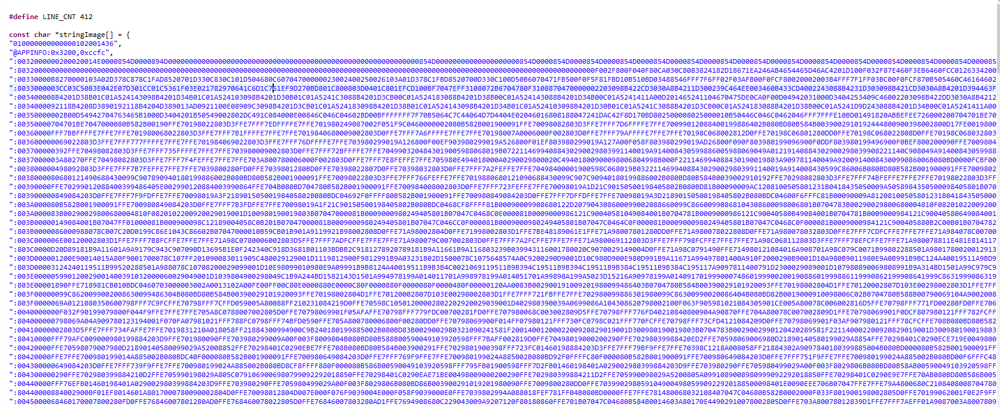


   ### Bootloader host program

   **Figure 12** illustrates a protocol-level diagram of a bootloader host and the target system. The bootloader host and target each have two blocks – the core and the communication layer.

   **Figure 12. Protocol level diagram of bootloading**
     
   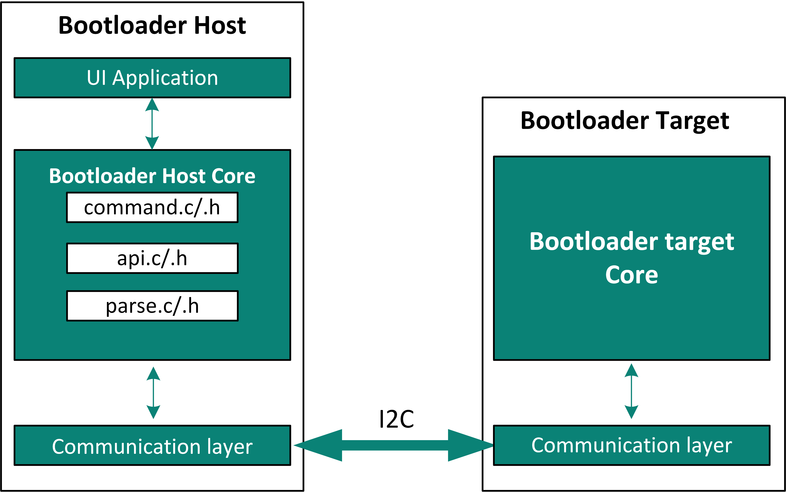

   The bootloader target core performs all the bootloading operations. The bootloader host core sends command packets and flash data to the target. Based on the response from the target, it decides whether to continue bootloading.

   The target core decodes the commands from the host, executes them by calling flash routines such as erase row, program row, and verify row, and forms response packets.

   The communication layer on the host and target provide a physical layer to support the bootloading protocols. They contain communication protocol (I2C) specific APIs to perform this function. This layer sends and receives protocol packets between the host and the target.

   
   ### Bootloader host core Files

   **cybtldr_parse.c / .h**

   This module handles the parsing of the *.cyacd2* string array that contains the bootloadable image to send to the device. It also has functions for setting up access to the file, reading the header, reading the row data as well.

   **cybtldr_api.c / .h**

   This is a row-level API file for sending a single row of data at a time to the bootloader target. It has functions for setting up the bootload operation, erasing a row, programming a row, verifying a row, and ending the bootload operation. **Table 1** describes in detail the functions of this API file.

   **Table 1. Functions of cybtldr_api.c /.h**

   Function  |  Description
   :------- | :------------
   CyBtldr_StartBootloadOperation | This function enables the communication interface and sends an Enter Bootloader command to the target.
   CyBtldr_ProgramRow | The host breaks the row data into smaller pieces and sends them to the target using Send Data commands. Along with the last portion of row data, it sends a Program Data command to program the target.
   CyBtldr_VerifyRow | This function breaks the row data into smaller pieces and sends them to the target using Send Data commands. Along with the last portion of row data, it sends a Verify Data command to verify the data present in the target flash.
   CyBtldr_EraseRow | This function sends an Erase Row command to erase a row from the flash row at a given address.
   CyBtldr_EndBootloadOperation | This function sends an Exit Bootloader command and disables the communication interface.
   <br>
   
   > **Note:** The buffer size of the bootloader is kept at 64 bytes. Therefore, the host can send only 64 bytes of data at a time to the bootloader. This includes the Start Of Packet (0x01), Command Code (1 byte), Data Length (2 bytes), Checksum (2 bytes), and End Of Packet (0x17), which means each transaction can send only 57 bytes of the actual data from each row. Therefore, each row is broken into smaller pieces and sent using multiple send data commands, as shown in **Figure 9**. The host sends a series of send data commands, followed by program data commands for each line of data. 

   **cybtldr_command.c / .h**

   This API handles the construction of command packets to the target and parses the response packets received from the target. The cybtldr_api.c / .h invokes the functions of this API. For example, to send an Enter Bootload command,
   CyBtldr_StartBootloadOperation() calls the CyBtldr_CreateEnterBootloadCmd() function of this API. It also has a function for calculating the checksum of the command packets before sending them to the target.

   **communication_api.c / .h**

   Host-side API functions for the communication layer are in communication_api.c / .h files. There are four functions – OpenConnection(), CloseConnection(), ReadData(), and WriteData(). They are pointed to by function pointers within the 'CyBtldr_CommunicationsData' structure, defined in cybtldr_api.h.

   You need to define these functions based on their communication layer. This example uses the I2C protocol. Therefore, the I2C-based functions are defined in this project and present in the communication_api.c / .h files. There are four functions – OpenConnection(), CloseConnection(), ReadData(), and 
   WriteData() functions. They are pointed to by function pointers within the 'CyBtldr_CommunicationsData' structure that gets initialized in the *main.c* file.

   > **Note:** This project has all the necessary files to create the I2C-based bootloader host on the PSoC&trade; 4 device.

   **Figure 13. Different API files**  
   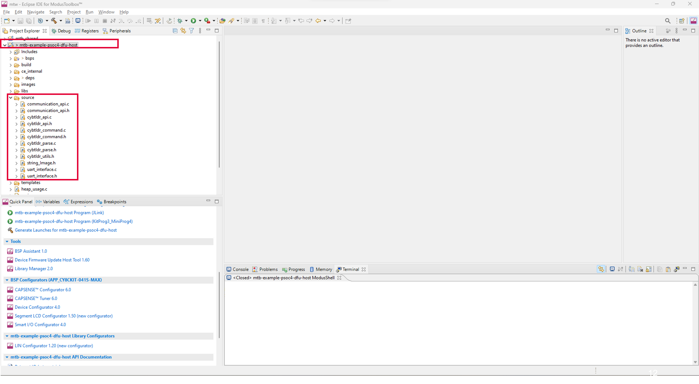

   ### DFU host interfaces

   The DFU host uses the I2C as the transport to communicate with the target bootloader.

   **Figure 14. Device Configurator**  
   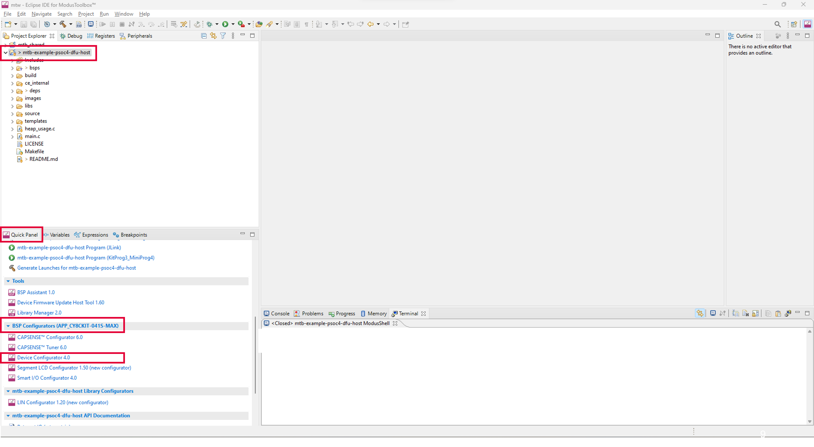

**Table 2** shows the default configuration. 

**Table 2. Default I2C configuration**

  Parameter| Default setting| Description
   :--------------- | :------ | :-----
   Mode  | Master | Device acts as a master
   Data rate |400 kbps| DFU supports standard data rates from 50 kbps to 1 Mbps

<br>

   **Figure 15. I2C configuration**  

   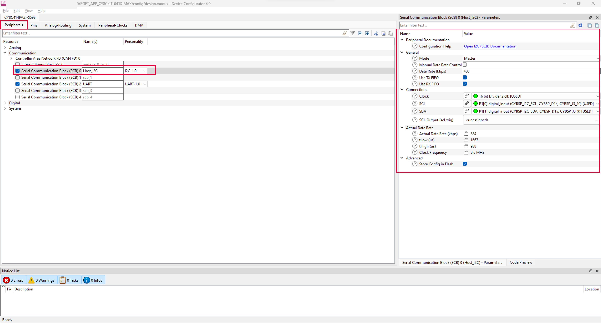

   <br>

**Table 3. Default UART configuration**

   Parameter| Default setting|Description
   :--------------- | :------ | :-----
   Com Mode | Standard | Standard, SmartCard, and IrDA are supported UART modes in SCB
   Baud rate(bps)|115200 | Supports standard baud rates from 19200 to 115200
   Bit order| LSB first| Standard frame
   Data width| 8 bits| Standard frame
   Parity| None | Standard frame
   Stop bits| 1 bit | Standard frame
   
<br>   
   
   **Figure 16. UART configuration**  
   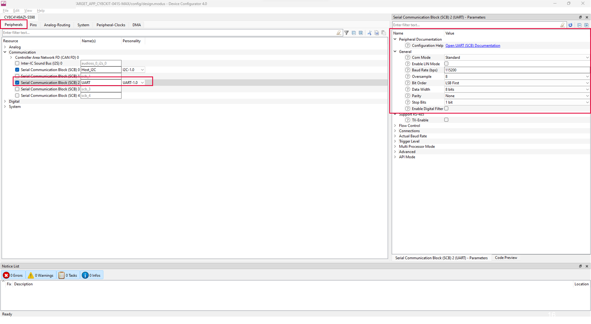
   
   <br>

### Resources and settings

**Table 4. DFU host resources**

 Resource  |  Alias/object     |    Purpose
 :------- | :------------    | :------------
 SCB (I2C) (PDL) | Host_I2C          | I2C master driver to communicate with the target   
 SCB (UART)(PDL) | UART              | UART driver to communicate with the PC
 GPIO (PDL)    | CYBSP_USER_LED         | User LED
 GPIO (PDL)    | CYBSP_USER_BTN         | User button

<br>

## Related resources


Resources  | Links
-----------|----------------------------------
Application notes  | [AN79953](https://www.infineon.com/AN79953) – Getting started with PSoC&trade; 4  
Code examples  | [Using ModusToolbox&trade;](https://github.com/Infineon/Code-Examples-for-ModusToolbox-Software) on GitHub
Device documentation | [PSoC&trade; 4 MCU datasheets](https://edit.infineon.com/cms/en/search.html?intc=searchkwr-return&_ga=2.236871304.809459600.1667797660-717891995.1665054803#!view=downloads&term=PSOC4&doc_group=Data%20Sheet) <br> [PSoC&trade; 4 technical reference manuals](https://www.infineon.com/cms/en/search.html#!term=Psoc%204%20technical%20reference%20manual&view=all)
Development kits | Select your kits from the [evaluation board finder](https://www.infineon.com/cms/en/design-support/finder-selection-tools/product-finder/evaluation-board)
Libraries on GitHub  | [mtb-pdl-cat2](https://github.com/Infineon/mtb-pdl-cat2) – PSoC&trade; 4 Peripheral Driver Library (PDL)  <br> [mtb-hal-cat2](https://github.com/Infineon/mtb-hal-cat2) – Hardware Abstraction Layer (HAL) library
Middleware on GitHub  | [Device Firmware Update (DFU) middleware library](https://github.com/Infineon/dfu) – Links to DFU SDK middleware
Tools  | [ModusToolbox&trade;](https://www.infineon.com/modustoolbox) – ModusToolbox&trade; is a collection of easy-to-use software and tools enabling rapid development with Infineon MCUs, covering applications from embedded sense and control to wireless and cloud-connected systems using AIROC&trade; Wi-Fi and Bluetooth&reg; connectivity devices.

<br>

## Other resources

Infineon provides a wealth of data at www.infineon.com to help you select the right device, and quickly and effectively integrate it into your design.


## Document history

Document title: *CE238156* – *PSoC&trade; 4: Device Firmware Upgrade (DFU) host*

 Version | Description of change
 ------- | ---------------------
 1.0.0   | New code example
 1.0.1   | Minor Readme update
 2.0.0   | README template update

<br>

All referenced product or service names and trademarks are the property of their respective owners.

The Bluetooth&reg; word mark and logos are registered trademarks owned by Bluetooth SIG, Inc., and any use of such marks by Infineon is under license.


---------------------------------------------------------

© Cypress Semiconductor Corporation, 2020-2023. This document is the property of Cypress Semiconductor Corporation, an Infineon Technologies company, and its affiliates ("Cypress").  This document, including any software or firmware included or referenced in this document ("Software"), is owned by Cypress under the intellectual property laws and treaties of the United States and other countries worldwide.  Cypress reserves all rights under such laws and treaties and does not, except as specifically stated in this paragraph, grant any license under its patents, copyrights, trademarks, or other intellectual property rights.  If the Software is not accompanied by a license agreement and you do not otherwise have a written agreement with Cypress governing the use of the Software, then Cypress hereby grants you a personal, non-exclusive, nontransferable license (without the right to sublicense) (1) under its copyright rights in the Software (a) for Software provided in source code form, to modify and reproduce the Software solely for use with Cypress hardware products, only internally within your organization, and (b) to distribute the Software in binary code form externally to end users (either directly or indirectly through resellers and distributors), solely for use on Cypress hardware product units, and (2) under those claims of Cypress's patents that are infringed by the Software (as provided by Cypress, unmodified) to make, use, distribute, and import the Software solely for use with Cypress hardware products.  Any other use, reproduction, modification, translation, or compilation of the Software is prohibited.
<br>
TO THE EXTENT PERMITTED BY APPLICABLE LAW, CYPRESS MAKES NO WARRANTY OF ANY KIND, EXPRESS OR IMPLIED, WITH REGARD TO THIS DOCUMENT OR ANY SOFTWARE OR ACCOMPANYING HARDWARE, INCLUDING, BUT NOT LIMITED TO, THE IMPLIED WARRANTIES OF MERCHANTABILITY AND FITNESS FOR A PARTICULAR PURPOSE.  No computing device can be absolutely secure.  Therefore, despite security measures implemented in Cypress hardware or software products, Cypress shall have no liability arising out of any security breach, such as unauthorized access to or use of a Cypress product. CYPRESS DOES NOT REPRESENT, WARRANT, OR GUARANTEE THAT CYPRESS PRODUCTS, OR SYSTEMS CREATED USING CYPRESS PRODUCTS, WILL BE FREE FROM CORRUPTION, ATTACK, VIRUSES, INTERFERENCE, HACKING, DATA LOSS OR THEFT, OR OTHER SECURITY INTRUSION (collectively, "Security Breach").  Cypress disclaims any liability relating to any Security Breach, and you shall and hereby do release Cypress from any claim, damage, or other liability arising from any Security Breach.  In addition, the products described in these materials may contain design defects or errors known as errata which may cause the product to deviate from published specifications. To the extent permitted by applicable law, Cypress reserves the right to make changes to this document without further notice. Cypress does not assume any liability arising out of the application or use of any product or circuit described in this document. Any information provided in this document, including any sample design information or programming code, is provided only for reference purposes.  It is the responsibility of the user of this document to properly design, program, and test the functionality and safety of any application made of this information and any resulting product.  "High-Risk Device" means any device or system whose failure could cause personal injury, death, or property damage.  Examples of High-Risk Devices are weapons, nuclear installations, surgical implants, and other medical devices.  "Critical Component" means any component of a High-Risk Device whose failure to perform can be reasonably expected to cause, directly or indirectly, the failure of the High-Risk Device, or to affect its safety or effectiveness.  Cypress is not liable, in whole or in part, and you shall and hereby do release Cypress from any claim, damage, or other liability arising from any use of a Cypress product as a Critical Component in a High-Risk Device. You shall indemnify and hold Cypress, including its affiliates, and its directors, officers, employees, agents, distributors, and assigns harmless from and against all claims, costs, damages, and expenses, arising out of any claim, including claims for product liability, personal injury or death, or property damage arising from any use of a Cypress product as a Critical Component in a High-Risk Device. Cypress products are not intended or authorized for use as a Critical Component in any High-Risk Device except to the limited extent that (i) Cypress's published data sheet for the product explicitly states Cypress has qualified the product for use in a specific High-Risk Device, or (ii) Cypress has given you advance written authorization to use the product as a Critical Component in the specific High-Risk Device and you have signed a separate indemnification agreement.
<br>
Cypress, the Cypress logo, and combinations thereof, ModusToolbox, PSoC, CAPSENSE, EZ-USB, F-RAM, and TRAVEO are trademarks or registered trademarks of Cypress or a subsidiary of Cypress in the United States or in other countries. For a more complete list of Cypress trademarks, visit www.infineon.com. Other names and brands may be claimed as property of their respective owners.
