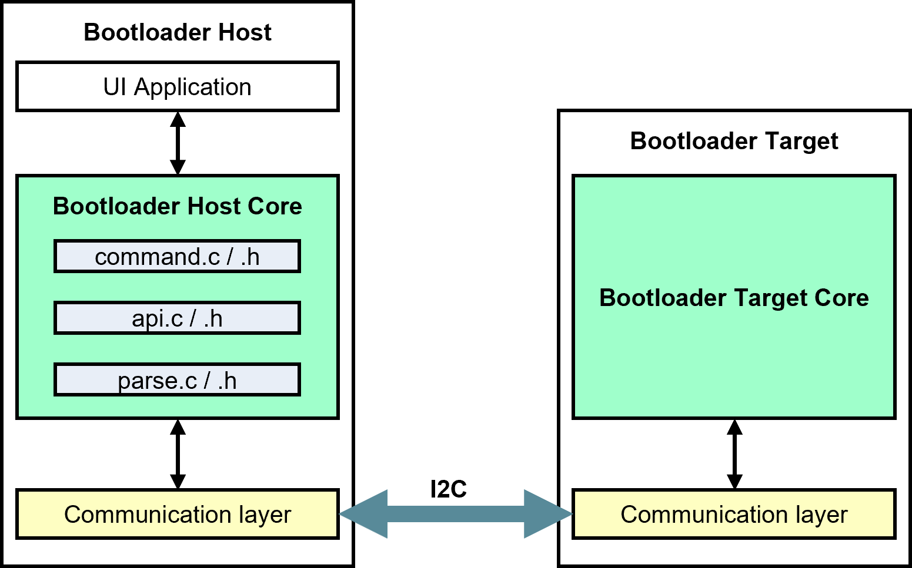

# PSOC&trade; 4: Device Firmware Upgrade (DFU) host

This example demonstrates how to create an I2C-based DFU Host on [PSOC&trade; 4100S Max Pioneer Kit](https://www.infineon.com/CY8CKIT-041S-MAX/) (`CY8CKIT-041S-MAX`) and flash the PSOC&trade; 4000T target device. 

This code example supports three actions; erase, program, and verify. Additionally, this project helps to understand how the DFU host works, communicates with the bootloader to update the firmware, and creates a DFU host on a PSOC&trade; 4100S Max Pioneer Kit using the ModusToolbox&trade;.

[View this README on GitHub.](https://github.com/Infineon/mtb-example-psoc4-dfu-host)

[Provide feedback on this code example.](https://yourvoice.infineon.com/jfe/form/SV_1NTns53sK2yiljn?Q_EED=eyJVbmlxdWUgRG9jIElkIjoiQ0UyMzgxNTYiLCJTcGVjIE51bWJlciI6IjAwMi0zODE1NiIsIkRvYyBUaXRsZSI6IlBTT0MmdHJhZGU7IDQ6IERldmljZSBGaXJtd2FyZSBVcGdyYWRlIChERlUpIGhvc3QiLCJyaWQiOiJsdWNreS5sdWNreUBpbmZpbmVvbi5jb20iLCJEb2MgdmVyc2lvbiI6IjMuMC4wIiwiRG9jIExhbmd1YWdlIjoiRW5nbGlzaCIsIkRvYyBEaXZpc2lvbiI6Ik1DRCIsIkRvYyBCVSI6IklDVyIsIkRvYyBGYW1pbHkiOiJQU09DIn0=)


## Requirements

- [ModusToolbox&trade;](https://www.infineon.com/modustoolbox) v3.7 or later

  > **Note:** This code example version requires ModusToolbox&trade; version 3.7 or later and is not backward compatible with v3.7 or older versions
- Board support package (BSP) minimum required version: 3.1.0
- Programming language: C
- Associated parts: All [PSOC&trade; 4 MCU](https://www.infineon.com/products/microcontroller/32-bit-psoc-arm-cortex/psoc-4-mcu) parts


## Supported toolchains (make variable 'TOOLCHAIN')

- GNU Arm&reg; Embedded Compiler v11.3.1 (`GCC_ARM`) – Default value of `TOOLCHAIN`
- Arm&reg; Compiler v6.16 (`ARM`)
- IAR C/C++ Compiler v9.30.1 (`IAR`)


## Supported kits (make variable 'TARGET')

- [PSOC&trade; 4100S Max Pioneer Kit](https://www.infineon.com/CY8CKIT-041S-MAX/) (`CY8CKIT-041S-MAX`) - Default value of `TARGET`


## Hardware setup

If the target PSOC&trade; 4000T is running at 3.3 V, change the jumper J10 pointed out in **Figure 1** of the CY8CKIT-041S-MAX kit to 3.3 V. If the target device is running at 1.8 V, it requires a logic-level translator in the I2C bus.

> **Note:** Ensure the target board is also powered appropriately.

**Figure 1. Jumper J10 to 3.3 V connection**
 


Connect the I2C pins, P\[1\]0 and P\[1\]1 (SCL and SDA), of CY8CKIT-041S-MAX to the I2C pins of the target board, Ensure both boards have a common ground.
**Figure 2** shows the Host and Target connected via I2C.

**Figure 2. Device connection using I2C**  


> **Note:** The earlier mentioned kit ship with the older version of KitProg firmware installed. You can upgrade to the latest version of the KitProg firmware. The tool and instructions are available in the [Firmware loader](https://github.com/Infineon/Firmware-loader) GitHub repository. If you do not upgrade, you will get a warning that "KitProg firmware is out of date, please update to the latest version".
<br>

## Using the code example


### Create the project

The ModusToolbox&trade; tools package provides the Project Creator as both a GUI tool and a command line tool.

<details><summary><b>Use Project Creator GUI</b></summary>

1. Open the Project Creator GUI tool

   There are several ways to do this, including launching it from the dashboard or from inside the Eclipse IDE. For more details, see the [Project Creator user guide](https://www.infineon.com/ModusToolboxProjectCreator) (locally available at *{ModusToolbox&trade; install directory}/tools_{version}/project-creator/docs/project-creator.pdf*)

2. On the **Choose Board Support Package (BSP)** page, select a kit supported by this code example. See [Supported kits](#supported-kits-make-variable-target)

   > **Note:** To use this code example for a kit not listed here, you may need to update the source files. If the kit does not have the required resources, the application may not work

3. On the **Select Application** page:

   a. Select the **Applications(s) Root Path** and the **Target IDE**

      > **Note:** Depending on how you open the Project Creator tool, these fields may be pre-selected for you

   b. Select this code example from the list by enabling its check box

      > **Note:** You can narrow the list of displayed examples by typing in the filter box

   c. (Optional) Change the suggested **New Application Name** and **New BSP Name**

   d. Click **Create** to complete the application creation process

</details>


<details><summary><b>Use Project Creator CLI</b></summary>

The 'project-creator-cli' tool can be used to create applications from a CLI terminal or from within batch files or shell scripts. This tool is available in the *{ModusToolbox&trade; install directory}/tools_{version}/project-creator/* directory.

Use a CLI terminal to invoke the 'project-creator-cli' tool. On Windows, use the command-line 'modus-shell' program provided in the ModusToolbox&trade; installation instead of a standard Windows command-line application. This shell provides access to all ModusToolbox&trade; tools. You can access it by typing "modus-shell" in the search box in the Windows menu. In Linux and macOS, you can use any terminal application.

The following example clones the "[PSOC&trade; 4: Device Firmware Upgrade (DFU) host](https://github.com/Infineon/mtb-example-psoc4-dfu-host)" application with the desired name "MyDFUHost" configured for the *CY8CKIT-041S-MAX* BSP into the specified working directory, *C:/mtb_projects*:

   ```
   project-creator-cli --board-id CY8CKIT-041S-MAX --app-id mtb-example-psoc4-dfu-host --user-app-name MyHelloWorld --target-dir "C:/mtb_projects"
   ```

The 'project-creator-cli' tool has the following arguments:

Argument | Description | Required/optional
---------|-------------|-----------
`--board-id` | Defined in the <id> field of the [BSP](https://github.com/Infineon?q=bsp-manifest&type=&language=&sort=) manifest | Required
`--app-id`   | Defined in the <id> field of the [CE](https://github.com/Infineon?q=ce-manifest&type=&language=&sort=) manifest | Required
`--target-dir`| Specify the directory in which the application is to be created if you prefer not to use the default current working directory | Optional
`--user-app-name`| Specify the name of the application if you prefer to have a name other than the example's default name | Optional

<br>

> **Note:** The project-creator-cli tool uses the `git clone` and `make getlibs` commands to fetch the repository and import the required libraries. For details, see the "Project creator tools" section of the [ModusToolbox&trade; tools package user guide](https://www.infineon.com/ModusToolboxUserGuide) (locally available at {ModusToolbox&trade; install directory}/docs_{version}/mtb_user_guide.pdf).

</details>


### Open the project

After the project has been created, you can open it in your preferred development environment.


<details><summary><b>Eclipse IDE</b></summary>

If you opened the Project Creator tool from the included Eclipse IDE, the project will open in Eclipse automatically.

For more details, see the [Eclipse IDE for ModusToolbox&trade; user guide](https://www.infineon.com/MTBEclipseIDEUserGuide) (locally available at *{ModusToolbox&trade; install directory}/docs_{version}/mt_ide_user_guide.pdf*).

</details>


<details><summary><b>Visual Studio (VS) Code</b></summary>

Launch VS Code manually, and then open the generated *{project-name}.code-workspace* file located in the project directory.

For more details, see the [Visual Studio Code for ModusToolbox&trade; user guide](https://www.infineon.com/MTBVSCodeUserGuide) (locally available at *{ModusToolbox&trade; install directory}/docs_{version}/mt_vscode_user_guide.pdf*).

</details>


<details><summary><b>Arm&reg; Keil&reg; µVision&reg;</b></summary>

Double-click the generated *{project-name}.cprj* file to launch the Keil&reg; µVision&reg; IDE.

For more details, see the [Arm&reg; Keil&reg; µVision&reg; for ModusToolbox&trade; user guide](https://www.infineon.com/MTBuVisionUserGuide) (locally available at *{ModusToolbox&trade; install directory}/docs_{version}/mt_uvision_user_guide.pdf*).

</details>


<details><summary><b>IAR Embedded Workbench</b></summary>

Open IAR Embedded Workbench manually, and create a new project. Then select the generated *{project-name}.ipcf* file located in the project directory.

For more details, see the [IAR Embedded Workbench for ModusToolbox&trade; user guide](https://www.infineon.com/MTBIARUserGuide) (locally available at *{ModusToolbox&trade; install directory}/docs_{version}/mt_iar_user_guide.pdf*).

</details>


<details><summary><b>Command line</b></summary>

If you prefer to use the CLI, open the appropriate terminal, and navigate to the project directory. On Windows, use the command-line 'modus-shell' program; on Linux and macOS, you can use any terminal application. From there, you can run various `make` commands.

For more details, see the [ModusToolbox&trade; tools package user guide](https://www.infineon.com/ModusToolboxUserGuide) (locally available at *{ModusToolbox&trade; install directory}/docs_{version}/mtb_user_guide.pdf*).

</details>


## Operation

1. Connect the board to your PC using the provided USB cable

2. Select the *mtb-example-psoc4-dfu-host* and click **Build Application** as shown in **Figure 3** to build the project

   **Figure 3. Building the application**
   
   

3. Flashing the project

   <details><summary><b>Using Eclipse IDE</b></summary>

      1. Select the application project in the Project Explorer

      2. In the **Quick Panel**, scroll down, and click **mtb-example-psoc4-dfu-host Program (KitProg3_MiniProg4)**

         **Figure 4. Flashing project** 
               
         

   </details>


   <details><summary><b>Using CLI</b></summary>

     From the terminal, execute the `make program` command to build and program the application using the default toolchain to the default target with default DFU transport. You can specify a target, toolchain, and transport manually:
      ```
      make program TOOLCHAIN=<toolchain>
      ```

      Example:
      ```
      make program TOOLCHAIN=GCC_ARM
      ```
      > **Note:** Modify the TOOLCHAIN variable from Makefile according to your requirement. However, you need to provide the compiler path in the variable named `CY_COMPILER_PATH=` in Makefile
      
   </details>


<br>

The DFU host can perform a firmware update on the target only if the DFU target has a compatible bootloader and is in Bootloader mode. If the PSOC&trade; 4000T DFU target device has previously been updated, it will boot to the application every time when it is powered up. The device must be switched to Bootloader mode by any existing mechanism in the application or by erasing the whole device and re-programming the bootloader.

To use the user button on the kit, you can either program and verify the firmware application into the target or erase the firmware application from the target.
   
- Press the user button (single-click) to program and verify the firmware application into the target device
- Press and hold the user button for a second to erase the firmware application into the target device

After programming the firmware image to the target device (PSOC&trade; 4000T MCU), the pin P0.4 of the target device (PSOC&trade; 4000T MCU) toggles at an interval of 500 ms.

The programming status from the DFU host board (i.e., PSOC&trade; 4100S Max Pioneer Kit) can display the programming status on a serial terminal (i.e., PuTTY), see **Figure 5**.

**Figure 5. Serial output**  


You can select the verbose option to print the commands and data that are sent to the target device (PSOC&trade; 4000T MCU) by the PSOC&trade; 4100S Max host. To enable it, set the `VERBOSE_PRINT` macro to '1' in the *cybtldr_api.c* file. 
The UART terminal displays the commands and the data that are sent over I2C, see **Figure 6**.

**Figure 6. Verbose output**  


By default, the application image present in the *stringImage.h* file of this code example blinks an LED. The target PSOC&trade; 4000T device Product ID is 0x3614. The application also implements an I2C slave peripheral at address `0x10`. When a particular command is received at this I2C address, the device switches to Bootloader mode. This command can be sent to I2C terminal software using an USB bridge or an MCU. The command consists of 3 bytes: `0x01, 0xEA, and 0x17`.


## Debugging

You can debug the example to step through the code.


<details><summary><b>In Eclipse IDE</b></summary>

Use the **\<Application Name> Debug (KitProg3_MiniProg4)** configuration in the **Quick Panel**. For details, see the "Program and debug" section in the [Eclipse IDE for ModusToolbox&trade; user guide](https://www.infineon.com/MTBEclipseIDEUserGuide).

</details>


<details><summary><b>In other IDEs</b></summary>

Follow the instructions in your preferred IDE.

</details>


## Design and implementation

### Overview

This example demonstrates the basic DFU operations based on the [DFU middleware library](https://github.com/Infineon/dfu).


### DFU host flow

This section explains how the DFU command response protocol works and how it is used to implement a DFU host on a PSOC&trade; 4100S Max Pioneer Kit.
   
The DFU process takes place through a series of commands and responses provided by the DFU middleware. **Figure 7** shows the default flow of commands and responses between the host and target during the update process. 
   
A DFU session always starts with an `Enter DFU` command from the host to the target. After the target acknowledges the command from the host, the DFU session is established. Commands and responses are exchanged between the host and the target to perform a specified function, such as data transfer and update. A session can be terminated with an `Exit DFU` command or by a timeout of 10 milliseconds (ms). This timeout resets after each command sent by the host at the host side. 
   
As shown in **Figure 7**, the host sends the data to the target by using a series of `send data` commands with data for a single row. A program data command for each row follows this, instructing the device to write a particular row of data into the device memory. Similarly, it can verify and erase the image by sending the appropriate commands. 

**Figure 7. DFU flow**
     


For more details on the command and response, see Appendix B of the [AN236282 – Device Firmware Update (DFU) middleware (MW) for ModusToolbox&trade;](https://www.infineon.com/AN236282).

   
### Application firmware image
   
To program the target device PSOC&trade; 4000T, the firmware image must be stored in the host MCU. To do so, convert the bootloadable *.cyacd2* file to a string array, where each line (row) will be represented as a string element of the array. Refer to Section 12.1 of [AN236282– Device Firmware Update (DFU) middleware (MW) for ModusToolbox&trade;](https://www.infineon.com/AN236282) for more about the file structure of *cyacd2* file.

An example of this string array is provided in this code example, which is stored in the *string_Image.h* file located in the source folder *mtb-example-psoc4-dfu-host/source*.
   
> **Note:** Each line inside the *.cyacd2* file is considered one row of data.

**Figure 8. *string_Image.h* file location**  


You can generate this *string_image.h* file from the *.cyacd2* file by copying each line, placing it as a string to form the array, and including it in the *main.c* file. This file is unique for each application, so every time you have to generate or make it separately.


### *string_Image.h* file structure

The structure of your *string_Image.h* file is predefined and needs to be consistent. It must contain a line count as a macro. This helps to identify the total number of lines (elements) present in the array. It must store all the data in the form of a string array, where each line of the *.cyacd2* file represents one element of an array. **Figure 9** shows the structure of the *string_Image.h* file.

**Figure 9. *string_Image.h* file structure**  
   


### Bootloader host program

**Figure 10** shows a protocol-level diagram of a bootloader host and the target system. The bootloader host and target each have two blocks: the core and the communication layer.

**Figure 10. Protocol level diagram of bootloading**
     


The bootloader target core performs all the bootloading operations. The bootloader host core sends command packets and flash data to the target. Based on the response from the target, it decides whether to continue bootloading.

The target core decodes the commands from the host, executes them by calling flash routines such as erase row, program row, and verify row, and forms response packets.

The communication layer on the host and target provide a physical layer to support the bootloading protocols. They contain communication protocol (I2C) specific APIs to perform this function. This layer sends and receives protocol packets between the host and the target.

   
### Bootloader host core files

**cybtldr_parse.c / .h**

This module handles the parsing of the *.cyacd2* file string array that contains the bootloadable image to send to the device. It also has functions for setting up access to the file, reading the header, and reading the row data.

**cybtldr_api.c / .h**

This is a row-level API file for sending a single row of data at a time to the bootloader target. It has functions for setting up the bootload operation, erasing a row, programming a row, verifying a row, and ending the bootload operation. **Table 1** describes in detail the functions of this API file.

**Table 1. Functions of cybtldr_api.c /.h**

Function  |  Description
:------- | :------------
`CyBtldr_StartBootloadOperation` | Enables the communication interface and sends an `Enter Bootloader` command to the target
`CyBtldr_ProgramRow` | The host breaks the row data into smaller pieces and sends them to the target using `Send Data` commands. Along with the last portion of row data, it sends a `Program Data` command to program the target
`CyBtldr_VerifyRow` | Breaks the row data into smaller pieces and sends them to the target using `Send Data` commands. Along with the last portion of row data, it sends a `Verify Data` command to verify the data present in the target flash
`CyBtldr_EraseRow` | Sends an `Erase Row` command to erase a row from the flash row at a given address
`CyBtldr_EndBootloadOperation` | Sends an `Exit Bootloader` command and disables the communication interface

<br>
   
> **Note:** The buffer size of the bootloader is kept at 64 bytes. Therefore, the host can send only 64 bytes of data at a time to the bootloader. This includes the Start Of Packet (0x01), Command Code (1 byte), Data Length (2 bytes), Checksum (2 bytes), and End Of Packet (0x17), which means each transaction can send only 57 bytes of the actual data from each row. Therefore, each row is broken into smaller pieces and sent using multiple `send data` commands, as shown in **Figure 7**. The host sends a series of `send data` commands, followed by program data commands for each line of data. 

**cybtldr_command.c / .h**

This API handles the construction of command packets to the target and parses the response packets received from the target. The *cybtldr_api.c / .h* invokes the functions of this API. For example, to send an `Enter Bootload` command, the `CyBtldr_StartBootloadOperation()` function calls the `CyBtldr_CreateEnterBootloadCmd()` function of this API. It also has a function for calculating the checksum of the command packets before sending them to the target.

**communication_api.c / .h**

Host-side API functions for the communication layer are in *communication_api.c / .h* files. There are four functions: `OpenConnection()`, `CloseConnection()`, `ReadData()`, and `WriteData()`. They are pointed to by function pointers within the `CyBtldr_CommunicationsData` structure, defined in the *cybtldr_api.h* file.

You need to define these functions based on their communication layer. This example uses the I2C protocol. Therefore, the I2C-based functions are defined in this project and present in the *communication_api.c / .h* files. There are four functions: `OpenConnection()`, `CloseConnection()`, `ReadData()`, and `WriteData()`. They are pointed to by function pointers within the `CyBtldr_CommunicationsData` structure that gets initialized in the *main.c* file.

> **Note:** This project has all the necessary files to create the I2C-based bootloader host on the PSOC&trade; 4 device.

**Figure 11. Different API files**


### DFU host interfaces

The DFU host uses the I2C as the transport to communicate with the target bootloader.

**Figure 12. Device Configurator**  


**Table 2** shows the default configuration. 

**Table 2. Default I2C configuration**

Parameter| Default setting| Description
:--------------- | :------ | :-----
Mode  | Master | Device acts as a master
Data rate |1000 kbps| DFU supports standard data rates from 50 kbps to 1 Mbps

<br>

**Figure 13. I2C configuration**  


<br>

**Table 3. Default UART configuration**

Parameter| Default setting|Description
:--------------- | :------ | :-----
Com Mode | Standard | Standard, SmartCard, and IrDA are supported UART modes in SCB
Baud rate (bps)|115200 | Supports standard baud rates from 19200 to 115200
Bit order| LSB first| Standard frame
Data width| 8 bits| Standard frame
Parity| None | Standard frame
Stop bits| 1 bit | Standard frame
   
<br>   
   
**Figure 14. UART configuration**  


   
<br>


### Resources and settings

**Table 4. DFU host resources**

Resource  |  Alias/object     |    Purpose
:------- | :------------    | :------------
SCB (I2C) (PDL) | Host_I2C          | I2C master driver to communicate with the target   
SCB (UART)(PDL) | UART              | UART driver to communicate with the PC
GPIO (PDL)    | CYBSP_USER_LED         | User LED
GPIO (PDL)    | CYBSP_USER_BTN         | User button

<br>


## Related resources

Resources  | Links
-----------|----------------------------------
Application notes  | [AN79953](https://www.infineon.com/AN79953) – Getting started with PSOC&trade; 4 MCU
Code examples  | [Using ModusToolbox&trade;](https://github.com/Infineon/Code-Examples-for-ModusToolbox-Software) on GitHub
Device documentation | [PSOC&trade; 4 MCU datasheets](https://documentation.infineon.com/psoc4/docs/qqs1702048028479) <br> [PSOC&trade; 4 technical reference manuals](https://documentation.infineon.com/psoc4/docs/hup1702048028817)
Development kits | Select your kits from the [Evaluation board finder](https://www.infineon.com/cms/en/design-support/finder-selection-tools/product-finder/evaluation-board)
Libraries on GitHub  | [mtb-pdl-cat2](https://github.com/Infineon/mtb-pdl-cat2) – PSOC&trade; 4 Peripheral Driver Library (PDL)  <br> [mtb-hal-cat2](https://github.com/Infineon/mtb-hal-cat2) – Hardware Abstraction Layer (HAL) library
Middleware on GitHub  | [Device Firmware Update (DFU) middleware library](https://github.com/Infineon/dfu) – Links to DFU SDK middleware
Tools  | [ModusToolbox&trade;](https://www.infineon.com/modustoolbox) – ModusToolbox&trade; software is a collection of easy-to-use libraries and tools enabling rapid development with Infineon MCUs for applications ranging from wireless and cloud-connected systems, edge AI/ML, embedded sense and control, to wired USB connectivity using PSOC&trade; Industrial/IoT MCUs, AIROC&trade; Wi-Fi and Bluetooth&reg; connectivity devices, XMC&trade; Industrial MCUs, and EZ-USB&trade;/EZ-PD&trade; wired connectivity controllers. ModusToolbox&trade; incorporates a comprehensive set of BSPs, HAL, libraries, configuration tools, and provides support for industry-standard IDEs to fast-track your embedded application development

<br>


## Other resources

Infineon provides a wealth of data at [www.infineon.com](https://www.infineon.com) to help you select the right device, and quickly and effectively integrate it into your design.


## Document history

Document title: *CE238156* – *PSOC&trade; 4: Device Firmware Upgrade (DFU) host*

 Version | Description of change
 ------- | ---------------------
 1.0.0   | New code example
 1.0.1   | Minor README update
 2.0.0   | README template update
 3.0.0   | Updated for ModusToolbox&trade; 3.7 and I2C data rate changed to 1000 kbps
<br>


All referenced product or service names and trademarks are the property of their respective owners.

The Bluetooth&reg; word mark and logos are registered trademarks owned by Bluetooth SIG, Inc., and any use of such marks by Infineon is under license.

PSOC&trade;, formerly known as PSoC&trade;, is a trademark of Infineon Technologies. Any references to PSoC&trade; in this document or others shall be deemed to refer to PSOC&trade;.

---------------------------------------------------------

(c) 2020-2025, Infineon Technologies AG, or an affiliate of Infineon Technologies AG. All rights reserved.
This software, associated documentation and materials ("Software") is owned by Infineon Technologies AG or one of its affiliates ("Infineon") and is protected by and subject to worldwide patent protection, worldwide copyright laws, and international treaty provisions. Therefore, you may use this Software only as provided in the license agreement accompanying the software package from which you obtained this Software. If no license agreement applies, then any use, reproduction, modification, translation, or compilation of this Software is prohibited without the express written permission of Infineon.
<br>
Disclaimer: UNLESS OTHERWISE EXPRESSLY AGREED WITH INFINEON, THIS SOFTWARE IS PROVIDED AS-IS, WITH NO WARRANTY OF ANY KIND, EXPRESS OR IMPLIED, INCLUDING, BUT NOT LIMITED TO, ALL WARRANTIES OF NON-INFRINGEMENT OF THIRD-PARTY RIGHTS AND IMPLIED WARRANTIES SUCH AS WARRANTIES OF FITNESS FOR A SPECIFIC USE/PURPOSE OR MERCHANTABILITY. Infineon reserves the right to make changes to the Software without notice. You are responsible for properly designing, programming, and testing the functionality and safety of your intended application of the Software, as well as complying with any legal requirements related to its use. Infineon does not guarantee that the Software will be free from intrusion, data theft or loss, or other breaches (“Security Breaches”), and Infineon shall have no liability arising out of any Security Breaches. Unless otherwise explicitly approved by Infineon, the Software may not be used in any application where a failure of the Product or any consequences of the use thereof can reasonably be expected to result in personal injury.
